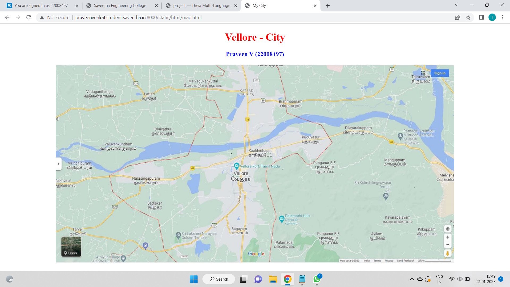
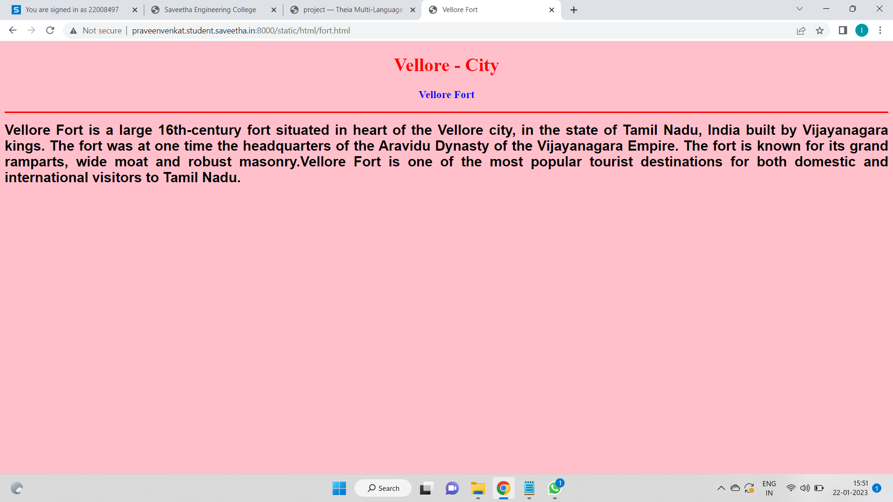
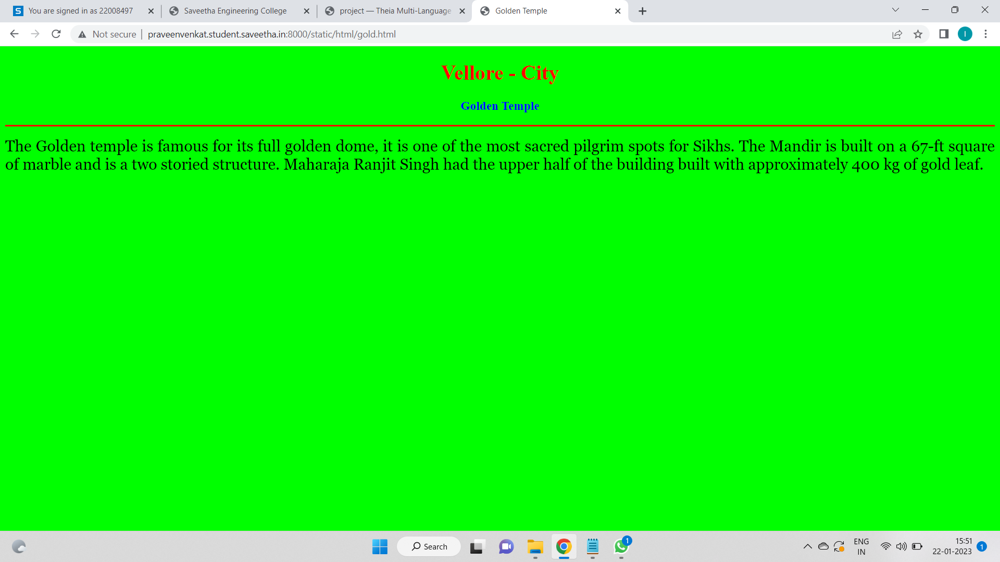
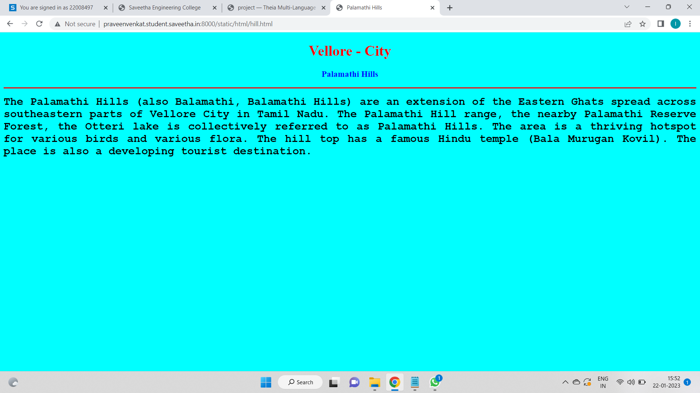
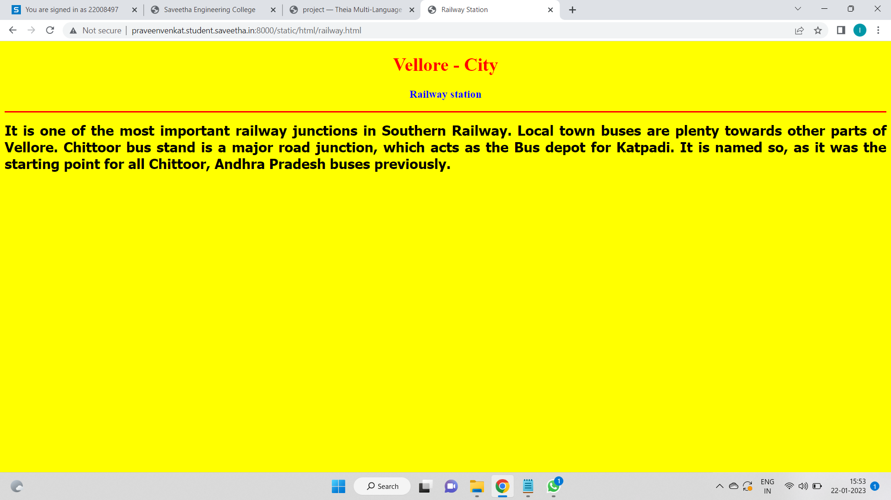
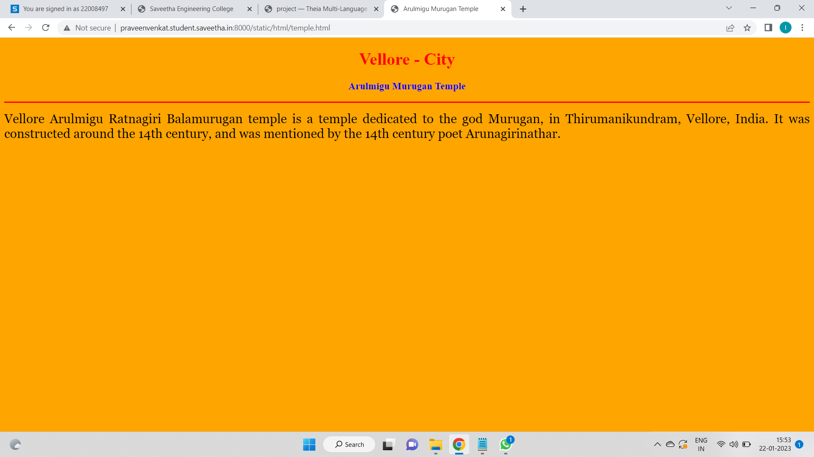
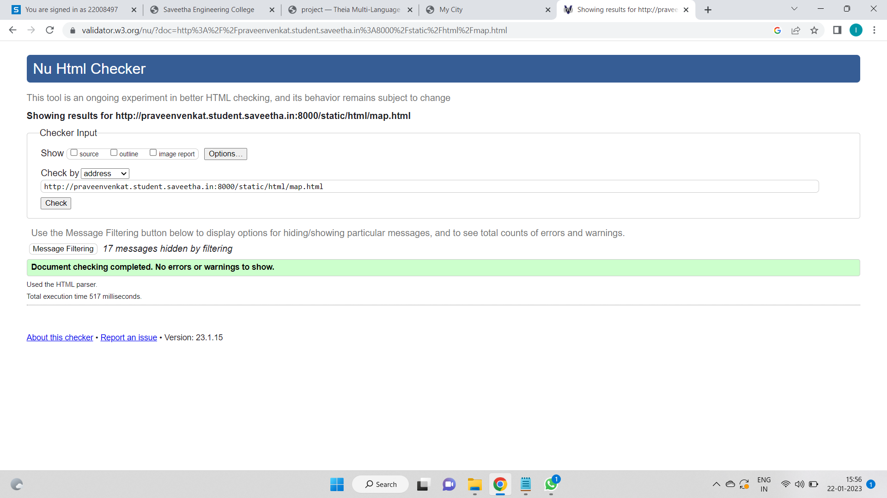

# Places Around Me
## AIM:
To develop a website to display details about the places around my house.

## Design Steps:

### Step 1:

Clone the github repository into Theia IDE.

### Step 2:

Create a new Django project.

## Step 3:

Write the needed HTML code.

## Step 4:

Run the Django server and execute the HTML files.

## Code:

```
map.html

<!DOCTYPE html>
<html lang="en">
<head>
<title>My City</title>
</head>
<body>
<h1 align="center">
<font color="red"><b>Vellore - City</b></font>
</h1>
<h3 align="center">
<font color="blue"><b>Praveen V (22008497)</b></font>
</h3>
<center>

<map name="MyCity">
<area shape="rectangle" coords="489,292,715,368" href="/static/html/fort.html" title="Vellore Fort">
<area shape="rectangle" coords="330,498,478,553" href="/static/html/gold.html" title="Golden Temple">
<area shape="rectangle" coords="521,61,650,117" href="/static/html/railway.html" title="Railway Station">
<area shape="rectangle" coords="638,437,786,503" href="/static/html/hill.html" title="Palamathi Hills">
<area shape="rectangle" coords="1013,186,1149,255" href="/static/html/temple.html" title="Arulmigu Murugan Temple">
</map>
</center>
</body>
</html>

fort.html

<!DOCTYPE html>
<html lang="en">
<head>
<title>Vellore Fort</title>
</head>
<body bgcolor="pink">
<h1 align="center">
<font color="red"><b>Vellore - City</b></font>
</h1>
<h3 align="center">
<font color="blue"><b>Vellore Fort</b></font>
</h3>
<hr size="3" color="red">
<p align="justify">
<font face="Arial" size="5">
<b>
Vellore Fort is a large 16th-century fort situated in heart of the Vellore city, in the state of Tamil Nadu, India built by Vijayanagara kings. The fort was at one time the headquarters of the Aravidu Dynasty of the Vijayanagara Empire. The fort is known for its grand ramparts, wide moat and robust masonry.Vellore Fort is one of the most popular tourist destinations for both domestic and international visitors to Tamil Nadu.
</b>
</font>
</p>
</body>
</html>

gold.html

<!DOCTYPE html>
<html lang="en">
<head>
<title>Golden Temple</title>
</head>
<body bgcolor="lime">
<h1 align="center">
<font color="red"><b>Vellore - City</b></font>
</h1>
<h3 align="center">
<font color="blue"><b>Golden Temple</b></font>
</h3>
<hr size="3" color="red">
<p align="justify">
<font face="Georgia" size="5">
The Golden temple is famous for its full golden dome, it is one of the most sacred pilgrim spots for Sikhs. The Mandir is built on a 67-ft square of marble and is a two storied structure. Maharaja Ranjit Singh had the upper half of the building built with approximately 400 kg of gold leaf.
</font>
</p>
</body>
</html>

hill.html

<!DOCTYPE html>
<html lang="en">
<head>
<title>Palamathi Hills</title>
</head>
<body bgcolor="cyan">
<h1 align="center">
<font color="red"><b>Vellore - City</b></font>
</h1>
<h3 align="center">
<font color="blue"><b>Palamathi Hills</b></font>
</h3>
<hr size="3" color="red">
<p align="justify">
<font face="Courier New" size="5">
<b>
The Palamathi Hills (also Balamathi, Balamathi Hills) are an extension of the Eastern Ghats spread across southeastern parts of Vellore City in Tamil Nadu. The Palamathi Hill range, the nearby Palamathi Reserve Forest, the Otteri lake is collectively referred to as Palamathi Hills. The area is a thriving hotspot for various birds and various flora. The hill top has a famous Hindu temple (Bala Murugan Kovil). The place is also a developing tourist destination.
</b>
</font>
</p>
</body>
</html>

railway.html

<!DOCTYPE html>
<html lang="en">

<head>
    <title>Railway Station</title>
</head>

<body bgcolor="yellow">
    <h1 align="center">
        <font color="red"><b>Vellore - City</b></font>
    </h1>
    <h3 align="center">
        <font color="blue"><b>Railway station</b></font>
    </h3>
    <hr size="3" color="red">
    <p align="justify">
        <font face="Tahoma" size="5">
            <b>
                 It is one of the most important railway junctions in Southern Railway. Local town buses are plenty towards other parts of Vellore. Chittoor bus stand is a major road junction, which acts as the Bus depot for Katpadi. It is named so, as it was the starting point for all Chittoor, Andhra Pradesh buses previously.
            </b>
        </font>
    </p>
</body>

</html>

temple.html

<!DOCTYPE html>
<html lang="en">
<head>
<title>Arulmigu Murugan Temple</title>
</head>
<body bgcolor="orange">
<h1 align="center">
<font color="red"><b>Vellore - City</b></font>
</h1>
<h3 align="center">
<font color="blue"><b>Arulmigu Murugan Temple</b></font>
</h3>
<hr size="3" color="red">
<p align="justify">
<font face="Georgia" size="5">
Vellore Arulmigu Ratnagiri Balamurugan temple is a temple dedicated to the god Murugan, in Thirumanikundram, Vellore, India. It was constructed around the 14th century, and was mentioned by the 14th century poet Arunagirinathar.
</font>
</p>
</body>
</html>

```

## Output:












## HTML VALIDATOR:



## Result:

The program for implementing image map is executed successfully.
